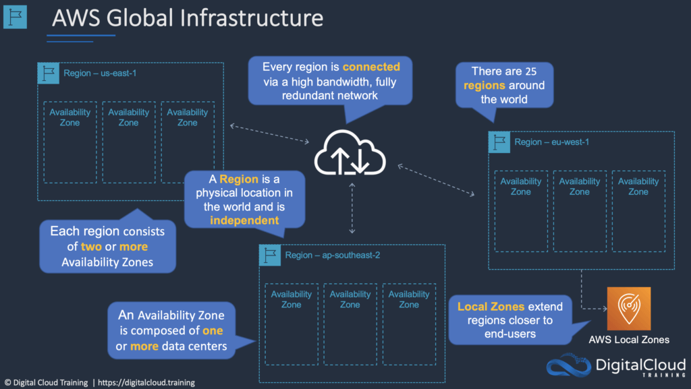
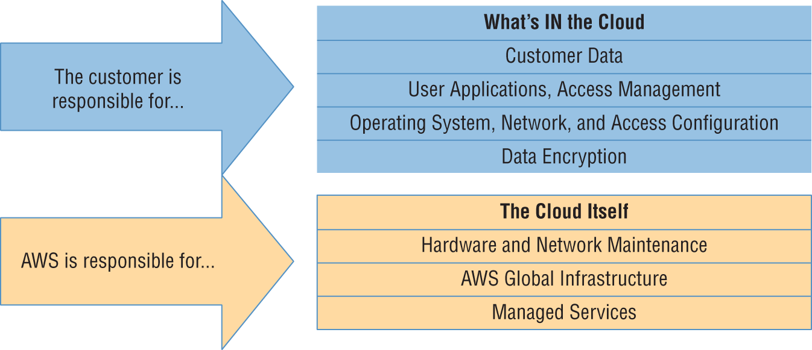
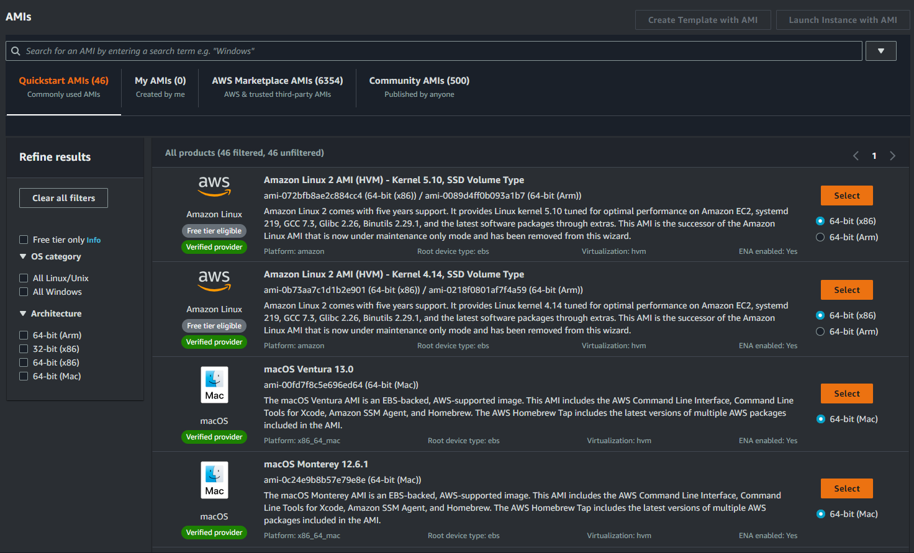
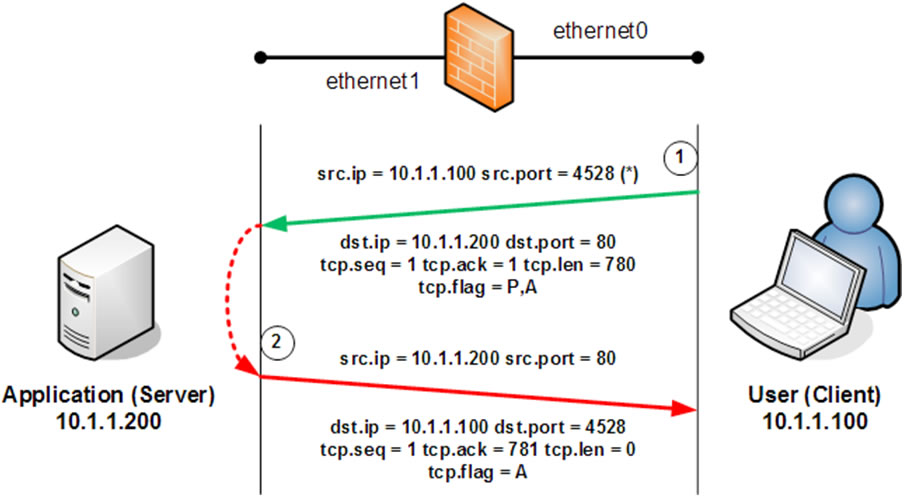
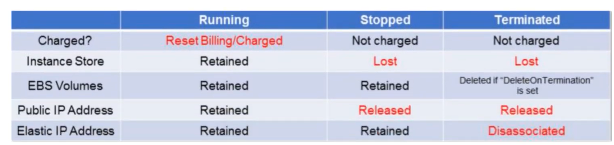
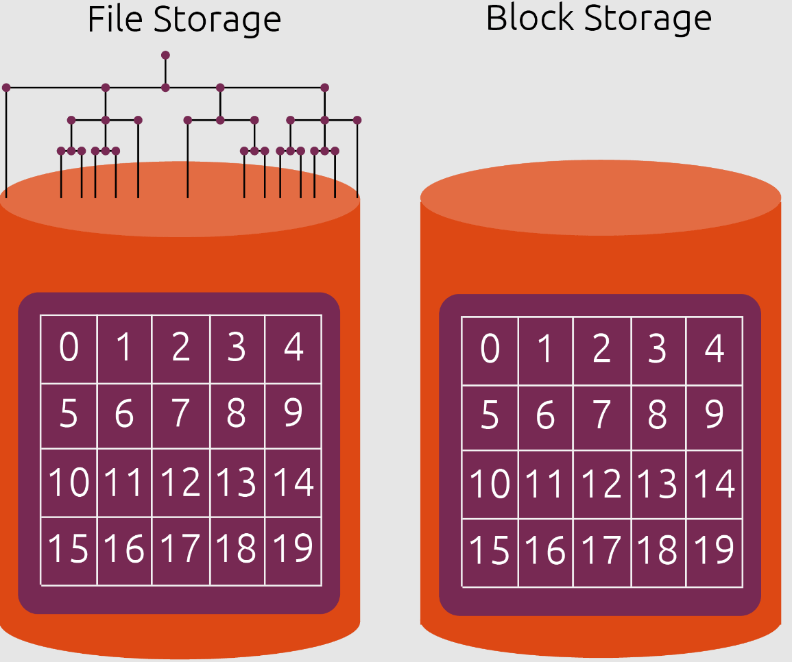
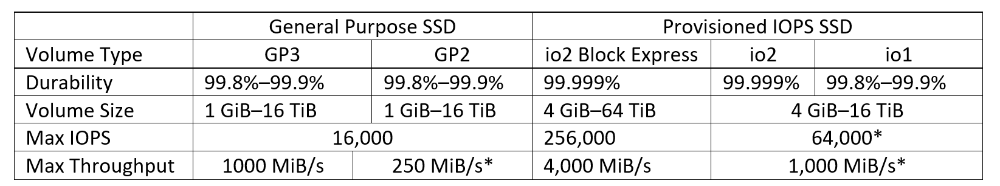
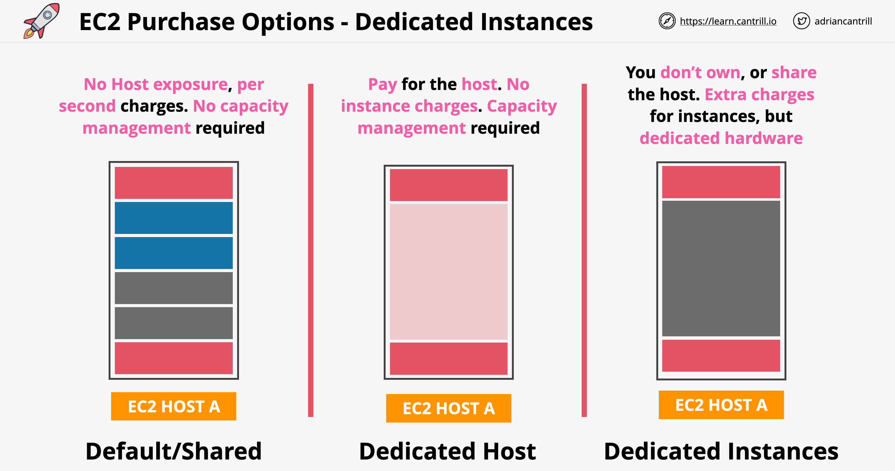
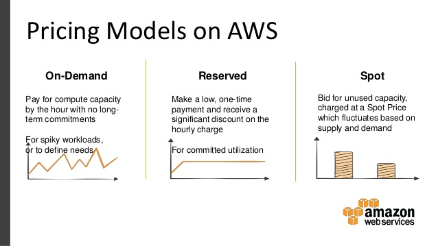

# AWS Notes

## Table of contents

* [1. Cloud Benefit](#1-cloud-benefit)
* [2. AWS Cloud](#2-aws-cloud)
    * [2.1 AWS Infrastructure](#21-infrastructure)
    * [2.2 AWS Reliability and Compliance](#22-aws-reliability-and-compliance)
    * [2.3 The AWS Shared Responsibility Model](#23-the-aws-shared-responsibility-model)
    * [2.4 AWS Management](#24-aws-management)
    * [2.5 Technical Support](#25-technical-support)
* [3. Compute Services](#3-compute-services)
    * [3.1 EC2](#31-ec2)
        * [3.1.1 AMI](#311-ami)
        * [3.1.2 Bootstraping](#312-bootstraping)
        * [3.1.3 Keypairs](#313-keypairs)
        * [3.1.4 Security Group](#314-security-group)
        * [3.1.5 Addressing](#315-addressing)
        * [3.1.6 Storage](#316-storage)
        * [3.1.7 Tenency Options](#317-tenency-options)
        * [3.1.8 Pricing Models](#318-pricing-models)
    * [3.2 AWS Systems Manager](#32-aws-system-manager)
* [4. S3](#4-s3)

## 1. Cloud Benefit

- On-demand: dùng bao nhiêu trả bấy nhiêu (pay as you go)
- Easy to scale and develop
- Quick deploy
- High avaibility
- High security
- PaaS

## 2. AWS Cloud
### 2.1 Infrastructure
AWS cung cấp nền tảng cơ sở hạ tầng công nghệ có tính sẵn sàng cao với nhiều khu vực trên toàn thế giới. Những khu vực này được gọi là **Region** và **Availability Zone**.
- **Region**: Một Region thường là môt khu vực địa lý riêng biệt có phạm vi thông thường ở quy mô là một quốc gia. Trong các Region này ta có các cụm server center và data center lần lượt được gọi là **AZ** (**Availability Zone**) và **Edge Location**.

- **Availability Zone**: Là các cụm server center được đặt cách xa nhau một khoảng cách đủ xa và có sự riêng biệt đia lý. Trong các cụm server center là các server center được đặt gần nhau. Và các AZ các server center sử dụng một đường truyền riêng nên tốc độ truyền tải, băng thông giữa các server center và AZ trong cùng một Region là lớn nhất.

- **Edge Location**: Là các cụm data center được đặt gần với người dùng nhằm caching các data thường xuyên, có lưu lượng truy cập lớn từ phía người dùng. Edge Location có tác dụng giảm tải băng thông cho các server và tăng trải nghiệm người dùng khi các data được caching lại sẽ được gửi từ các Edge Location này mà không cần phải request tới server khiến tốc độ trả về là rất nhanh. Ngoài ra còn có **Region Edge Location** cũng tương tự như Edge Location nhưng dùng để caching các data ít được truy cập hơn.

### 2.2 AWS Reliability and Compliance

AWS tuân thủ tất cả các quy định chung, pháp lý và bảo mật của các quốc gia và quốc tế.

### 2.3 The AWS Shared Responsibility Model

Cả AWS và phía người dùng đều có trách nhiệm về việc bảo vệ các tài nguyên của AWS Cloud. Trong đó người dùng có trách nhiệm ở mức PaaS, tức là chịu trách nhiệm cho các tài nguyên mà người dùng khởi tạo và quản lý, còn AWS sẽ chịu trách nhiệm cho toàn bộ hệ thống của họ.

### 2.4 AWS Management

Để quản lý AWS account ta có các service sau:
- **IAM service**: quản lý tài khoản, quyền truy cập, quyền sử dụng tài nguyên, bảo mật của tài khoản và các user trong tài khoản và giám sát các hoạt động truy cập vào tài nguyên.

- **AWS Organization**: cho phép quản lý nhiều tài khoản thông qua một tài khoản root, user cũng sẽ được quản lý bởi tài khoản root (bao gồm cả quyền truy cập vào tài nguyên của tài khoản).

- **AWS Control Tower**: được thiết kế để giúp tổ chức triển khai và quản lý môi trường đám mây AWS một cách an toàn và chặt chẽ. Nó cung cấp một bộ công cụ và quy trình tự động để triển khai và quản lý nền tảng đám mây AWS với các quy tắc bảo mật và quyền lợi tiêu chuẩn. Các tính năng chính của AWS Control Tower bao gồm: "Account Vending, Xây Dựng Mô Hình Tài Khoản và Quy Tắc Landing Zone, Quản Lý Quyền Đơn Nhất."

- **AWS Service Catalog**: để giúp tổ chức quản lý và triển khai các dịch vụ và ứng dụng trên nền tảng đám mây AWS một cách tự động và tuân thủ. Nó cung cấp một cách để tổ chức tài nguyên công nghệ thông tin (IT) và cung cấp các tùy chọn tự động hóa để người sử dụng có thể triển khai các dịch vụ một cách dễ dàng và tuân thủ các quy tắc tổ chức. Các tính năng chính của AWS Service Catalog bao gồm: "Quản Lý Tài Nguyên, Triển Khai Tự Động, Tuân Thủ Chuẩn Mức, Quản Lý Quyền Lợi, Ghi Nhật Ký và Giám Sát."

- **AWS License Manager**: là dịch vụ quản lý và kiểm soát quyền sử dụng phần mềm cũng như giữ cho việc sử dụng phần mềm nằm trong khuôn khổ của các điều khoản cấp phép. Dịch vụ này giúp tổ chức giảm rủi ro và chi phí liên quan đến việc không tuân thủ các điều khoản cấp phép phần mềm. Các tính năng chính của AWS License Manager bao gồm: "Quản Lý Cấp Phép Đa Dạng, Theo Dõi Sử Dụng Cấp Phép, Tự Động Hóa Tuân Thủ Cấp Phép, Phát Hiện Vi Phạm, Tối Ưu Hóa Chi Phí."

- **AWS Artifact**: là một kho lưu trữ số cho phép khách hàng tải xuống thông tin liên quan đến tuân thủ về tài khoản và dịch vụ AWS của họ. Bạn có thể sử dụng AWS Artifact để truy cập các báo cáo tuân thủ và thông tin kiểm toán bảo mật, chẳng hạn như báo cáo SOC (AWS Service Organization Control), báo cáo PCI DSS (Payment Card Industry Data Security Standard), và chứng nhận ISO 27001. AWS Artifact cũng giúp bạn dễ dàng chia sẻ thông tin liên quan đến tuân thủ với các kiểm toán viên và các bên liên quan khác.

- Ngoài ra ta có thể tương tác với AWS Cloud thông qua AWS CLI, AWS Console, AWS SDKs.

### 2.5 Technical Support

AWS cung cấp nhiều gói hỗ trợ để đáp ứng nhu cầu và yêu cầu của các khách hàng với các mức độ và loại hỗ trợ khác nhau. Dưới đây là một số gói hỗ trợ phổ biến của AWS:

- **Basic plan**: Hỗ trợ qua email để giải đáp các câu hỏi cơ bản về sử dụng dịch vụ AWS, truy cập vào các tài nguyên trực tuyến như tài liệu và diễn đàn hỗ trợ. Plan này miễn phí

- **Developer plan**: Bao gồm tất cả các ưu đãi của Basic plan, hỗ trợ kỹ thuật qua email và trang web, được hỗ trợ với các vấn đề kỹ thuật cơ bản và các câu hỏi về thiết kế ứng dụng. Developer plan có giá hỗ trợ bắt đầu từ 29$/tháng hoặc 3% tổng chi phí hằng tháng của AWS.

- **Business plan**: Bao gồm tất cả các ưu đãi của Developer plan, hỗ trợ kỹ thuật qua điện thoại cho các vấn đề cấp độ kinh doanh và triển khai ứng dụng, hỗ trợ với các vấn đề bảo mật không ổn định và sự kiện quan trọng. Có giá từ 100$/tháng hoặc 10% tổng chi phí hằng tháng của AWS (up to 10000$) và có 1 API support.

- **Enterprise plan**: Bao gồm tất cả các ưu đãi của Business plan, hỗ trợ kỹ thuật 24/7 qua điện thoại và email, dành cho các doanh nghiệp với yêu cầu hỗ trợ cao cấp và yêu cầu độ ổn định cao. Có giá từ 5500$/tháng hoặc 10% 

- **Premium plan**: Bao gồm tất cả các ưu đãi của Enterprise plan, bổ sung với các dịch vụ tư vấn và quản lý hỗ trợ, được cung cấp dịch vụ **Account Manager** để hỗ trợ chiến lược và quản lý hỗ trợ.

## 3. Compute Services

### 3.1 EC2
**EC2** được viết tắt từ **Elastic Cloud Compute** là một dịch vụ cung cấp các máy ảo được hỗ trợ đa dạng hệ điều hành từ Amazon và cả các nhà phát hành chính thưc của hệ điều hành đó.

Mỗi một máy ảo như thế được gọi là một **Instance**. Các instances được phân loại theo type và family phụ thuộc vào sự tối ưu của thành phần mà instance đó được tối ưu hiệu năng. VD: so với thông thường thì sẽ sử dụng RAM drr3 nhưng với dòng memory optimized thì hiệu năng RAM sử dụng được tăng lên là drr4 hoặc drr5,…

Các Instance type:
- **General purpose**: Loại phổ thông với các hiệu năng mọi mặt ở mức tối thiểu nhu cầu sử dụng (Mac, T4g, T3, T2, M6g, M6i, M6a, M5, M5a, M5n, M5zn, M4, A1).

- **Compute optimized**: Cung cấp hiệu năng CPU cao nhất với chi phí là rẻ nhất trong các type, phù hợp cho các công việc nghiên cứu, tính toán như: AI, machine learning,… (C7g, C6g, C6i, C6a, Hpc6a, C5, C5a, C5n, C4)

- **Memoty optimized**: Cung cấp hiệu năng RAM cao nhất với chi phí là rẻ nhất trong các type, chẳng hạn như database (R6g, R6i, R5, R5a, R5b, R5n, R4, X2gd, X2idn, X2iedn, X2iezn, X1e, X1, High Memory, z1d).

- **Storage optimized**: Cung cấp hiệu năng I/O của Disk là cao nhất với chi phí là rẻ nhất trong các type, VD: big data,… (P4, P3, P2, DL1, Trn1, Inf1, G5, G5g, G4dn, G4ad, G3, F1, VT1)

- **Accelerated compute**: Cung cấp hiệu năng về GPU với chi phí rẻ phù hợp với các công việc cần đồ họa nặng như: render, eidit video, graphics,… (Im4gn, Is4gen, I4i, I3, I3en, D2, D3, D3en, H1)

Các main component trong EC2 bao gồm:

#### 3.1.1 AMI

Đây là thành phần quan trọng không thể thiếu của một instance. AMI viết tắt của Amazon Machine Images chứa các thông tin về boot, snapshot. metadata, volume mount, hay nói dễ hiểu hơn nó là 1 image chứa thông tin về hệ điều hành sử dụng để launch instance (có 3 HĐH cơ bản: Linux, MacOS, Windows).

AMI được cung cấp bởi các nguồn sau:
- **Published by AWS**: được tạo và cung cấp bởi AWS.

- **The AWS Marketplace**: đây là chợ AMI được cung cấp từ nhiều nguồn bao gồm cả nhà phát hành chính thức, các tổ chức lớn và cả các cá nhân.

- **Generated by existing instances**: AWS hỗ trợ việc tạo 1 AMI từ 1 instance đang tồn tại và launch bởi người dùng. 

- **Private**: AMI được tạo ở local của người dùng được upload lên để sử dụng.

- **Community**: AMI được tạo và chia sẻ bởi cộng đồng người dùng AWS.

Một số thì free và đa phần là tính phí vì các phiên bản hệ điều hành đó đều được tùy biến, tích hợp những gì cần thiết theo nhu cầu người dùng.

Sau khi purchased thì không thể thay đổi hệ điều hành.

Một số particular AMI chỉ có ở 1 region nhất định và nếu không thể khởi tạo instance từ AMI của region khác với region làm việc.

#### 3.1.2 Bootstraping
Cung cấp cho người dùng khả năng khởi tạo nhiều instance với các cấu hình, package được setup trước cùng lúc thông qua code, các đoạn code này được gọi là Userdata. Các trường hợp sử dụng:

- Áp dụng các bản vá lỗi và cập nhật cho hệ điều hành.

- Enroling in a directory service.

- Installing application software.

#### 3.1.3 Keypairs
Để kết nối tới các instance ở AWS EC2 ta có 2 dạng kết nối:

- SSH với Public/Private key (Linux/MacOS)

- RDP (Remote Desktop Protocol) (Windows)

#### 3.1.4 Security Group
Tương tự như firewall security group cũng có 2 chiều là **inbound** và **outbound**. Theo mặc định outbound sẽ được setting cho phép all traffics còn inbound sẽ là port 22 cho ssh. Security group là 1 statefull nên mặc dù ở inbound ta không cho phép một số cổng mà vẫn nhận được response, tức là nó sẽ cho phép các request đi ra (outbound) và các response trả về của request ấy.

#### 3.1.5 Addressing
Mỗi một instance sau khi được launch sẽ có 1 IP Pricate, 1 IP Public và một Public Domain Name System (DNS) Name (Phân giải cho IP Public).

IP Public sẽ mất mỗi khi stop instances, sau khi start lại sẽ được cấp 1 IP Public khác để giải quyết điều đó AWS cung cấp 1 tính năng là Elastic IP giữ lại IP public đó, Elastic IP free khi sử dụng nhưng khi không sử dụng mà giữ lại IP thì sẽ bị tính phí cực gắt gao từ AWS vì gây thiếu hụt tài nguyên mạng.

#### 3.1.6 Storage
Nói đến storage quay lại vấn đề là khi 1 instance bị stop thì chúng ta sẽ bị mất data, làm sao để giải quyết vấn đề đó? Nhìn vào bảng dưới đây để thấy rõ sự ảnh hưởng sau khi status của 1 instance thay đổi.

EC2 có 3 loại storage chính là **Instance store** (volume vật lý của server nơi instance được launch, mặc định), **EBS volume** và **EFS volume**. Nhưng ở đây ta sẽ so sánh giữa EBS và Instance store vì đây mới là 2 storage dùng để lưu trữ data hệ thống của instance. Theo như trong bảng ta thấy rằng  khi instance ở trạng thái stop, terminated thì instance store sẽ bị mất data còn EBS thì vẫn còn. Vậy EBS là gì?

Thông thường ta có 2 dạng lưu trữ chính là **file store higher-system** với cấu trúc phân cấp theo từng thư mục và file, loại còn lại là **block store** thuộc **lower-system** lưu trữ data theo từng block. Block store sẽ chuyển đổi file thành các chuỗi data lưu theo từng block mỗi block mang 1 ID riêng biệt, việc chỉnh sửa cũng sẽ được thực hiện trực tiếp vào từng block thông qua ID nên cực kỳ nhanh chóng và hiệu quả nên block store thường được dùng để lưu trữ file hệ thống, boot, snapshot. File store lưu trữ phân cấp nên khi chúng ta sửa đổi file thì nó không trực tiếp sửa data mà clone ra 1 data mới chỉnh sửa trên đó, sau khi xong sẽ xóa đi file cũ lưu file mới đã được chỉnh sửa (đây là lí do ta loại bỏ EFS).

**EBS** viết tắt của **Elastic Block Store**, là 1 block store thường được sử dụng để lưu trữ các data của instance ở các EBS server riêng, để kết nối tới EBS ta dùng **giao thức ISCSI** hoặc **Fibre Channel**. EBS là mất phí, vì vậy nên cân nhắc sử dụng cho hiệu quả.

EBS volume có thể được copy bằng cách tạo ra các snapshot từ chúng. Các snapshot đó có thể được dùng để tạo ra các volume khác có khả năng shared/attached vào các instance khác và cũng có thể dùng để tạo ra các AMIs (Mặc dù AMIs có thể được tạo trực tiếp từ 1 instance đang running nhưng tốt nhất hãy shutdown instance rồi khởi tạo hoặc tạo từ 1 snapshot để tránh việc thất thoát data).

EBS volume cũng phân thành nhiều loại để đáp ứng các nhu cầu khác nhau về I/O của người dùng:

- **EBS-Provisioned IOPS SSD**: cung cấp khả về I/O cao up to throughput 4000MB/s và 256.000 IOPS/volume, cũng là option có chi phí cao nhất.

- **EBS General-Purpose SSD**: tuy không bằng Provisioned IOPS nhưng cũng mang lại hiệu suất có độ trễ thấp, maximum lên tới 16.000 IOPS/volume và mức chi phí bỏ ra cũng phù hợp.

- **HDD Volumes**: hay còn được gọi là **Magnetic volume** có phí trên mỗi gigabytes là thấp nhất vì hiệu xuất IOPS cũng là thấp nhất, range size từ 1GB - 1TB, tốc độ IOPS trung bình là 100, chi phí lưu trữ được tính dựa vào không gian dung lượng chọn. VD ta chọn space EBS size là 10Gb mà thức tế ta chỉ dùng 2Gb thì tiền thanh toán sẽ là 10Gb (mốc ban đầu ta chọn).

#### 3.1.7 Tenency Options
Tenacy là việc thuê resource của AWS để sử dụng, chúng ta có thể chọn các options sau để sử dụng resource một cách hợp lý theo nhu cầu và install instance trên chúng.

- **Share Tenacy**: đây là option mặc định của AWS, khi sử launch 1 instance trên AWS thì chúng ta đang sử dụng resource được chia sẻ bởi 1 server của AWS nên mới có hiện tượng là sau khi ta stop instance đó đi thì sau khi start lại instance sẽ bị mất data, setup do sau khi start instance hiện tại đang sử dụng resource được chia sẻ bởi 1 server khác. Vì vậy share tenacy là rẻ nhất.

- **Dedicated Instance**: thuê cố định resource, ở trường hợp này là cố dịnh tất cả các resource của instance, việc này chi phí mắc hơn share nhưng được cái sau khi stop và start tại vẫn còn data, setup đã dùng.

- **Dedicated Host**: thuê cố định luôn server vật lý, chi phí thì chắc chắn mắc x5 x10, thường được sử dụng với nhu cầu về VPC.

#### 3.1.8 Pricing Models
Việc sử dụng instance được tính phí theo giờ nên có 3 option như sau để tối ưu chi phí sử dụng nhất:

- **On-demand**: xài bao nhiêu trả bấy nhiêu, resource không cố định (sau khi stop instance sẽ bị mất data vì sau khi start lại instance thì instance sẽ được setup trên một server khác), trả sau.

- **Reserved instance**: cố định resource, thanh toán với khoảng thời gian commit trước, xài càng nhiều càng ưu đãi upto 75%.

- **Spot instance**: đặt ra mốc Bid price để kiểm soát chi phí, khi Spot price thay đổi thấp hơn Bid price đưa ra thì instance sẽ được launch và running còn ngược lại instance sẽ bị terminated.

Càng nhiều người dùng sử dụng thì giá của EC2 càng giảm.

#### 3.1.9 EC2 Auto Scaling
**EC2 Auto Scaling** là 1 dịch vụ được tạo ra nhằm phục vụ cho HA luôn giữ cho 1 , nó sẽ tự động phục hồi ứng dụng khi bị lỗi hoặc khởi tạo thêm instance trong phạm vi số lượng cho trước khi traffic hoặc performance của instance hiện tại tăng cao đột biến, hoặc khi instance chạy fail hoặc terminated nó sẽ tự động replace instance đó. Để thực hiện được việc tự động này EC2 Auto Scaling phụ thuộc vào Launch Configuration và Launch Template.

- **Launch configuration**: là tập hợp toàn bộ thông tin cấu hình của instance như khi ta launch 1 instance và khai báo chúng (AMI, instance type, key pair, security group, user data,...) nhưng chỉ được sử dụng bởi EC2 Auto Scaling.

- **Launch template**: cũng giống như launch configuration nhưng linh hoạt hơn, thay vì chỉ được sử dụng bởi Auto Scaling thì ta có thể tạo nhanh 1 instance từ launch template hoặc cũng có thể tạo hàng loạt. Launch template đánh dấu version mỗi khi có thay đổi giúp ta có thể dễ dàng chuyển đổi giữa các version theo nhu cầu.

**Auto scaling group**: là group của các instance được quản lý để thực hiện việc scale.

**Load Balancer**: dùng để phân phối traffic tới các instance trong Auto scaling group, có thể được khai báo khi khởi ataoj Auto scaling group

**Health Checks Against Application Instances**

Khi khởi tạo 1 Auto scaling group, nó sẽ luôn maintain một lượng minimum instance hoặc với số lượng intance chỉ định được cấu hình từ trước. Khi 1 instance unhealthy lập tức Auto scaling sẽ terminate và replace nó. Auto scaling health check thông qua các servcie như: **"CloudTrail, CloudWatch, AWS Config"**, chỉ kiểm tra về system performance và host status. 

Khi 1 instance fail load balancer lập tức chuyển toàn bộ traffic đang có sang các instance khác hoặc tạo instance mới, xóa instance fail và chuyển traffic vào instance đó (trường hợp chỉ maintain số lượng active instance là 1).

**Configuring Scaling Policies**

Ta cần phải khai báo rõ ràng minimum và maximum size của Auto scaling group để Auto scaling tăng giảm số lượng instance cho phù hợp dựa vào sự tăng giảm của performance hoặc hoặc status hoặc traffic hoặc cả 3 của instance. Ta cũng có thể khai báo số lượng instance mong muốn Auto scaling duy trì luôn hoạt động thông qua việc set desired capacity cho Auto scaling group.

- **Minimum**: Auto scaling luôn đảm bảo số lượng healthy instance luôn nằm ở mức minimum. Nếu set minimum=0 trong 1 Auto scaling group thì Auto scaling sẽ terminate tất cả running instance đang có của Auto scaling group đó. 

- **Maximum**: là giới hạn đưa ra nhằm bảo đảm số lượng healthy insatance sinh sôi không vượt qua ngưỡng đặt ra.

- **Desired capacity**: Auto scaling sẽ luôn đảm bảo số lượng instance bạn khai báo alive, nhưng không nhất thiết phải khai báo tham số này. Nếu tham số desired capacity không được khai báo thì Auto scaling sẽ tự động tạo khai báo với range nằm giữa minimum và maximum. Desired capacity còn được gọi là `group size`.

**Auto scaling method options**

- **Manual scaling**: ta có thể set các điều kiện cho trước để Auto scaling phụ thuộc vào đó tiến hành scale down or scale up instance cho phù hợp thông qua các tham số `minimum`, `desired capacity` và `maximum`. Các thông số này một khi được update Auto scaling group ngay lập tức áp dụng và điều chỉnh lại số lượng instance.

- **Dynamic scaling policies**: Auto scaling sẽ tự động bump instance trước khi instance đến ngưỡng quá tải dựa vào `CloudWatch` alarm. CloudWatch lấy metric từ instance và phân thành các group như sau: `Average CPU utilization`, `Average request count per target`, `Average network bytes in`, `Average network bytes out`. Ngoài các native metric group trên, ta có thể tự định nghĩa thông qua metric filter. Dynamic scaling policies được phân làm 3 loại: simple, step, and target tracking. 

    - **Simple scaling policies**: phụ thuộc vào các `adjustment types` mà khi instance metric vượt ngưỡng sẽ có các hình thức hoạt động khác nhau. Mỗi adjustment types đều cần thông qua 1 khoảng thời gian chờ gọi là `cooldown` mới thực hiện việc scale instance, `default cooldown=300s`, ta có thể điều chỉnh lại theo nhu cầu hoặc tắt bằng cách set `cooldown=0`, khi 1 instance được xác định là unhealthy Auto scaling sẽ bỏ qua thời gian chờ cooldown mà ngay lập tức replace unhealthy instance.  VD: Auto scaling vừa thực hiện scale instance nhưng vẫn nhận được alarm thì nó sẽ chờ heert cooldown time bắt đầu scale lần tiếp theo.
        - **ChangeInCapacity**: tăng công suất theo 1 lượng nhất định (chỉ định số lượng instance scale bằng 1 giá trị cụ thể). VD: desired ban đầu là 4 và ta chỉ muốn tăng 2 instance thì Auto scaling sẽ tăng thêm lượng instance bằng 6, nếu ta lại set giá trị tăng chỉ là 1 thì khi Auto scaling scale instance cũng chỉ mở rộng thêm 1 instance, tổng số instance lúc này là 5. 
    
        - **ExactCapacity**: chỉ định số lượng capacity trực tiếp. VD: desired capacity đang là 2, tạo policy để đổi thành 3 khi tải tăng.

        - **PercentChangeInCapacity**: chỉ định số lượng instance scale phụ thuộc vào `%` số lượng instance hiện tại. VD: desired capacity đang là 4 và ta set tăng 50% khi tải tăng thì Auto scaling sẽ bump instance thêm 2 (50% của 4), lúc này số tổng instance là 6. Nếu sau khi Auto scale bump xong mà vẫn nhận alarm (đã đạt điều kiện cooldown time), Auto scaling sẽ tiếp tục bump instance thêm 3 (50% của 6), lúc này tổng số instance sẽ là 9 khi và chỉ khi maximum capacity được set lớn hơn hoặc bằng 9, số lượng instance bump bởi Auto scaling không thể vượt quá maximum capacity.

    - **Step scaling policies**: scale instance thông qua CloudWatch alarm, chỉ định ngưỡng scale với lượng instance cụ thể thông qua 1 tập hợp các bước thực hiện còn gọi là `step adjustment`. VD: khi average CPU utilization đạt ngưỡng 50% thì tạo thêm 2 instance, 60% thì tạo 4 instance

### 3.2 AWS System Manager

## 4. S3